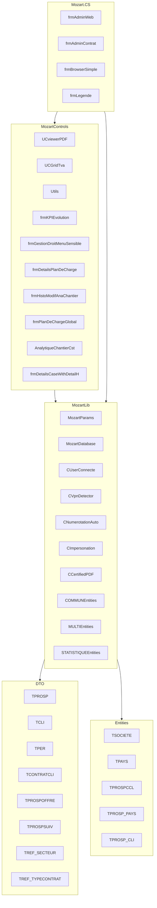

    

    <b>Automatic Architecture Diagrams from Code</b> 
    <a href="https://github.com/swark-io/swark">GitHub</a> • <a href="https://swark.io">Website</a> • <a href="mailto:contact@swark.io">Contact Us</a>

## Usage Instructions

1. **Render the Diagram**: Use the links below to open it in Mermaid Live Editor, or install the [Mermaid Support](https://marketplace.visualstudio.com/items?itemName=bierner.markdown-mermaid) extension.
2. **Recommended Model**: If available for you, use `claude-3.5-sonnet` [language model](vscode://settings/swark.languageModel). It can process more files and generates better diagrams.
3. **Iterate for Best Results**: Language models are non-deterministic. Generate the diagram multiple times and choose the best result.

## Generated Content
**Model**: GPT-4o - [Change Model](vscode://settings/swark.languageModel)  
**Mermaid Live Editor**: [View](https://mermaid.live/view#pako:eNp9VdtuozAQ_RXEc7sfkIeVsoa0aHNhg2lVDVHllEliCeysMam6Vf99HcCA26QvZs6cM-PxwJh3_0Xm6E_8TOwVOx48GmTC86p628KF_MeUJlJoJYvqTHleSk4cX1HFwQxG9sayd4rn9MSgtyyjeVFBs3aenSp_x1F4kkWtuRTwCQ-qO6zOjkBJrhco6gRFxbcFwjfcEB2gZmbTuGAiQHJgat8EXnAPMfe80nIhc76bCmZIoTkquEYMceNsd4XcsgIuersIk6N40_xvjTYVqTRc9H45D2EVPnJ9aOE9XGWaSBR5Ji682znftolbGDPFygrGYDPmA6bZ1qQHF3YaklamVikEvmgEB1nFw9F0QhuPVDAGll_WJSqp2fmdTmst4YvHKqPyiKqSoiHAhVZDUGm-45ifP1YHWcVqsUiXoWmyaXMFLrQnT-c06iUO6hQJndIoodGfNOx1F3xXXkRAV20aGq9XSQzto0tNyTyC82JxHK7hvPT8aknX007W25txxtVstg5hZDtskkYPMJiWW4ez5yQkNEzNfiMw5ulTHHZ7wmfHlcPaXnRZkhWJQmqK64y-sulTAs3q1ErIHHrLYZ67iN522aY9vfntRPwgST9q07zk4hG3MLI3LttcjkzDJzyofin5agYh4eWxvbEcx6Cb496U1Cg60y3TvYu929uf7gj3oKG6j8p1jpvfH_ZaJpca_gH-jW8GsmQ8N_-N98zXBywx8yde5ue4Y3WhM__DiOpjzjQGnJnmlv5EqxpvfGYGOHkTLxYrWe8P_mTHigo__gNLtz_O) | [Edit](https://mermaid.live/edit#pako:eNp9VdtuozAQ_RXEc7sfkIeVsoa0aHNhg2lVDVHllEliCeysMam6Vf99HcCA26QvZs6cM-PxwJh3_0Xm6E_8TOwVOx48GmTC86p628KF_MeUJlJoJYvqTHleSk4cX1HFwQxG9sayd4rn9MSgtyyjeVFBs3aenSp_x1F4kkWtuRTwCQ-qO6zOjkBJrhco6gRFxbcFwjfcEB2gZmbTuGAiQHJgat8EXnAPMfe80nIhc76bCmZIoTkquEYMceNsd4XcsgIuersIk6N40_xvjTYVqTRc9H45D2EVPnJ9aOE9XGWaSBR5Ji682znftolbGDPFygrGYDPmA6bZ1qQHF3YaklamVikEvmgEB1nFw9F0QhuPVDAGll_WJSqp2fmdTmst4YvHKqPyiKqSoiHAhVZDUGm-45ifP1YHWcVqsUiXoWmyaXMFLrQnT-c06iUO6hQJndIoodGfNOx1F3xXXkRAV20aGq9XSQzto0tNyTyC82JxHK7hvPT8aknX007W25txxtVstg5hZDtskkYPMJiWW4ez5yQkNEzNfiMw5ulTHHZ7wmfHlcPaXnRZkhWJQmqK64y-sulTAs3q1ErIHHrLYZ67iN522aY9vfntRPwgST9q07zk4hG3MLI3LttcjkzDJzyofin5agYh4eWxvbEcx6Cb496U1Cg60y3TvYu929uf7gj3oKG6j8p1jpvfH_ZaJpca_gH-jW8GsmQ8N_-N98zXBywx8yde5ue4Y3WhM__DiOpjzjQGnJnmlv5EqxpvfGYGOHkTLxYrWe8P_mTHigo__gNLtz_O)

