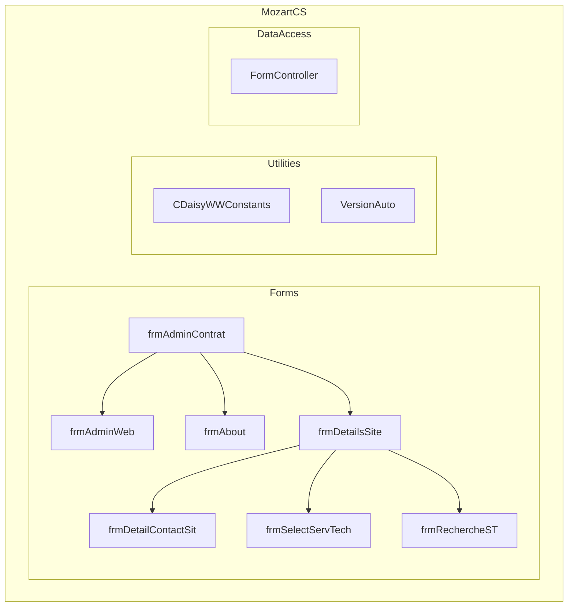

    

    <b>Automatic Architecture Diagrams from Code</b> 
    <a href="https://github.com/swark-io/swark">GitHub</a> • <a href="https://swark.io">Website</a> • <a href="mailto:contact@swark.io">Contact Us</a>

## Usage Instructions

1. **Render the Diagram**: Use the links below to open it in Mermaid Live Editor, or install the [Mermaid Support](https://marketplace.visualstudio.com/items?itemName=bierner.markdown-mermaid) extension.
2. **Recommended Model**: If available for you, use `claude-3.5-sonnet` [language model](vscode://settings/swark.languageModel). It can process more files and generates better diagrams.
3. **Iterate for Best Results**: Language models are non-deterministic. Generate the diagram multiple times and choose the best result.

## Generated Content
**Model**: GPT-4o - [Change Model](vscode://settings/swark.languageModel)  
**Mermaid Live Editor**: [View](https://mermaid.live/view#pako:eNqFkU1qwzAQha8itE4u4EUh2HTXTe3WG23G0jgW6CeMRoU05O6VY2qcQpOFEPPme6Ph6SJ1NCgrqcKR4DSJrlFBiJSHpXyL30Bct7O4kV8j-bRoQozkD8bbUMfABCz2-5dV63F4hg0x8xOmQQbrUmsZN-RGvQdnN2gujcd0iw4LhvTVoZ4es--FQCqn7RYQg_kTygdbZ9niGkzdgE3nvi_7JIbAa-MTKdkYDpnjf8MaYDhojWk1zZnfconOId35bpfcSY_kwZrynRcleUKPSlZCSYMjZMdKXguUTwYYGwvlIS8rpow7CWWV9hz0b00xHydZjeASXn8AyNW2_w) | [Edit](https://mermaid.live/edit#pako:eNqFkU1qwzAQha8itE4u4EUh2HTXTe3WG23G0jgW6CeMRoU05O6VY2qcQpOFEPPme6Ph6SJ1NCgrqcKR4DSJrlFBiJSHpXyL30Bct7O4kV8j-bRoQozkD8bbUMfABCz2-5dV63F4hg0x8xOmQQbrUmsZN-RGvQdnN2gujcd0iw4LhvTVoZ4es--FQCqn7RYQg_kTygdbZ9niGkzdgE3nvi_7JIbAa-MTKdkYDpnjf8MaYDhojWk1zZnfconOId35bpfcSY_kwZrynRcleUKPSlZCSYMjZMdKXguUTwYYGwvlIS8rpow7CWWV9hz0b00xHydZjeASXn8AyNW2_w)

